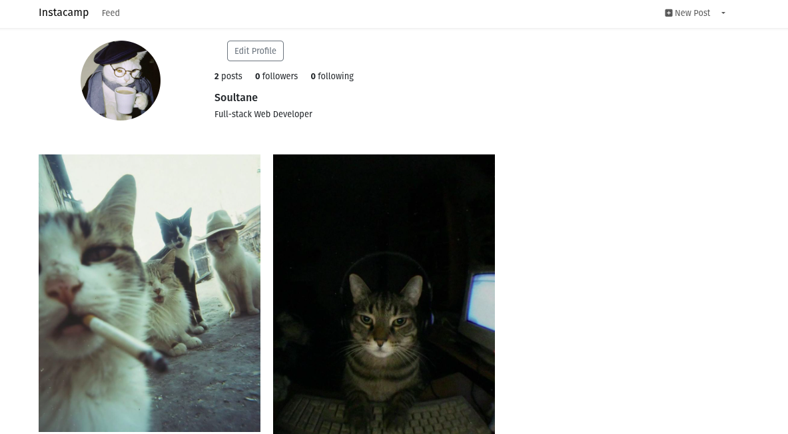

# 📸 Instacamp

A full-stack social media application built with **Laravel 10** and **MongoDB**. This project features user authentication, image posts, profiles, comments, and a "like" system, demonstrating robust NoSQL integration with Laravel Eloquent.

## 🚀 Features

* **User Authentication:** Secure Registration, Login, and Logout.
* **Feed System:** View latest posts from all users.
* **Post CRUD:** Create, Read, Update (Caption), and Delete posts.
* **Image Handling:** File uploads stored securely via Laravel Storage.
* **Interactions:** Like/Unlike posts and add comments.
* **Profile Management:** Edit bio, username, and upload profile avatars.
* **Security:** Authorization policies (users can only edit/delete their own content).

## 🛠️ Tech Stack

* **Framework:** Laravel 10 / 11
* **Language:** PHP 8.4
* **Database:** MongoDB (NoSQL)
* **Driver:** `mongodb/laravel-mongodb`
* **Frontend:** Blade Templates + Bootstrap (or Tailwind)

## ⚙️ Prerequisites

Ensure your machine has the following installed:

* PHP 8.4
* Composer
* MongoDB Server (Community Edition)
* Required Extensions: `php-mongodb`, `php-curl`, `php-mbstring`, `php-xml`

## 📱 App Preview

Check out the user profile interface:




## 📦 Installation Guide

Follow these steps to set up the project locally:

### 1. Clone the Repository
```bash
git clone [https://github.com/YOUR_GITHUB_USERNAME/instacamp.git](https://github.com/SoultaneRaqi
/instacamp.git)
cd instacamp
```

### 2. Install Dependencies
```Bash

composer install
```

### 3. Configure Environment
Copy the example environment file and generate your application key:
```Bash

cp .env.example .env
php artisan key:generate
```
### 4. Configure Database (.env)

Open the .env file and configure your MongoDB connection.

```Bash

DB_CONNECTION=mongodb
DB_HOST=127.0.0.1
DB_PORT=27017
DB_DATABASE=instacamp
DB_USERNAME=your_db_username
DB_PASSWORD=your_db_password
DB_AUTHENTICATION_DATABASE=admin
```

### 5. Link Storage
Create the symbolic link to serve uploaded images publicly:

```Bash

php artisan storage:link
```

### ▶️ Running the Application
Start the local development server:

```Bash

php artisan serve
Visit http://127.0.0.1:8000 in your browser.
```

### 📂 Project Structure
app/Models/: Contains MongoDB-extended Eloquent models (User, Post, Like).

app/Http/Controllers/: Handles request logic (PostController, ProfileController, etc.).

routes/web.php: Application routes defined with standard RESTful conventions.

### 🤝 Contributing
Fork the repository.

Create a new branch (git checkout -b feature/AmazingFeature).

Commit your changes (git commit -m 'Add some AmazingFeature').

Push to the branch (git push origin feature/AmazingFeature).

Open a Pull Request.

### 📝 License
This project is open-sourced software licensed under the MIT license.